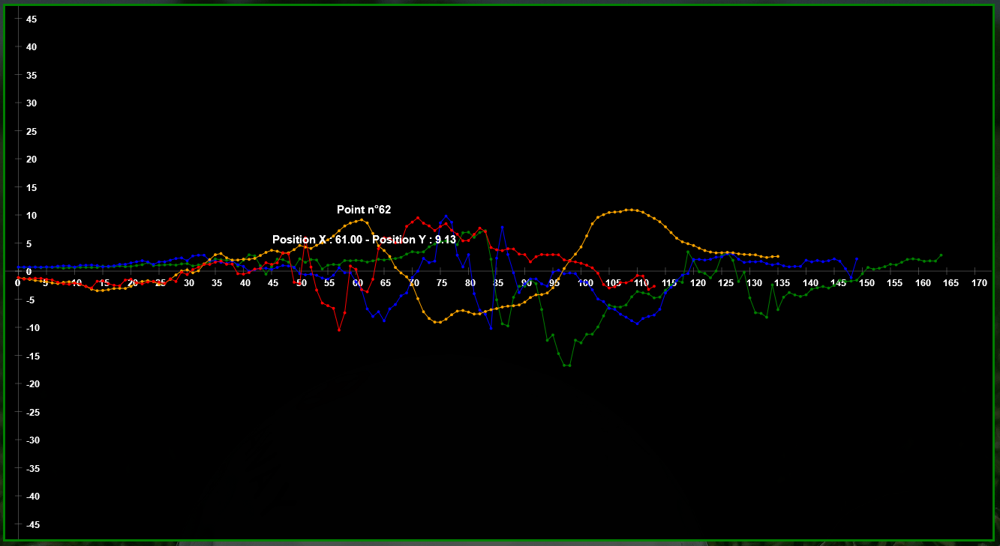

# TsEasyCanvas
## Dessins de graphiques dans canvas HTML en TypeScript.

Projet ayant pour but d'expérimenter TypeScript.

Conversion du canvas utilisé dans le projet Golf (https://tp-ssh1.dep-informatique.u-psud.fr/~alherit/L3S5_projet_web/golf/index.php) en une simple api en TypeScript.



## Compilation
```
tsc -p tsconfig.json
```

## Utilisation

Lancer le .html dans votre navigateur.

Documentation en cours d'écriture.

## Changelog :

### Version Alpha 190826.1 :

- Ajout de la possibilité de construire un Canvas avec une liste de couleurs perso.

- Ajout d'accesseurs pour la liste de couleurs.

- Système de "old ctx.font" retiré (désuet ici).

- Changement de taille des chiffres du repère refonctionne.

- L'affichage du texte canvas fonctionne.

- Ajout de la méthode "origine_au_centre()" [-> Projet Golf].

- Ajout de la fonction "init_canvas()" dans canvas.ts permettant d'initialiser le canvas,

  modification de l'element canvas dans l'index.html sans les events,

  ajout d'un fichier "examples.ts" pour mettre des exemples d'utilisations du canvas.

- Ajout d'options dans la colonne option dans le index.html :

  Origine au milieu 						[-> Projet Golf]

  Afficher le cadrillage 					[-> Projet Golf]

  Afficher le repère 						[-> Projet Golf]

  Taille des chiffres sur les axes 		[-> Projet Golf]

  Pas appliqué aux graduations			[-> Projet Golf]

  Taille des points 						[-> Projet Golf]

  Taille des lignes reliant les points	[-> Projet Golf]

  Affichage texte

  Zoom

- Ajout de vérifications dans set_zoom().
